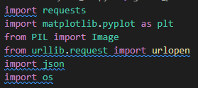

# 
 Proyecto M4 

# 
 CONSTRUYE UNA POKÉDEX.  

  

 -OLAF DE JESÚ CRUZ GUTIÉRREZ- 

<H1 align="center">¿Cómo lo hice? </H1>

Comencé probando la API en un API tester y familiarizandome con la estructura de los datos de los Pokémones (las unidades en que están expresados el peso por ejemplo) en la documentación de la API.

Posteriormente comencé importando las librerías:

