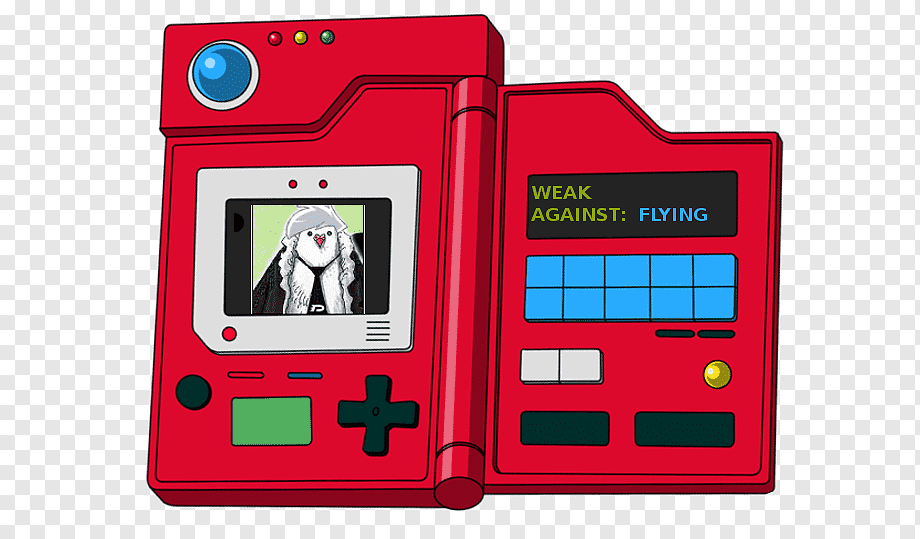

# 
 Proyecto M4 

# 
 CONSTRUYE UNA POKÉDEX.  

  

 -OLAF DE JESÚ CRUZ GUTIÉRREZ- 

<H1 align="center">¿Cómo lo hice? </H1>

Comencé probando la API en un API tester y familiarizandome con la estructura de los datos de los Pokémones (las unidades en que están expresados el peso por ejemplo) en la documentación de la API.

Posteriormente comencé importando las librerías:

 
   -Requests: La utilicé para hacer la petición a la API.
   -matplotlib con pyplot para usar las funciones que permiten mostrarnos la imagen que obtendremos con otras librerías.
   -El objeto "Image" del módulo "PIL" para abrir la imagen que obtenemos con la siguiente librería.
   -El objeto "urlopen" de "request" que a su vez se encuentra dentro del módulo "urllib" para abrir la url ya extraída de la API.
   -"json" para el manejo del archivo en formato JSON.
   -"os" para verificar si el archivo JSON está vacío.
  

  Inicié con una impresión de un texto como bienvenida y posteriormente la llamada de la función que hace la llamada a la API y de esa función se desencadenan las demás.
   Dentro de la función que hace la llamada a la API, hay condicionales.

-Principalmente comprobamos que si la respuesta de la API es satisfactoria (200) procedamos al demás código.
   -Si la respuesta arrojara un código "404" nos indica que el pokémon no fue encontrado, por lo que el programa volverá a preguntar por otro pokémon.
   -Finalmente si arrojara un código diferente, se cerraría el programa.
  
Obteniendo un código "200" nos imprime un mensaje de que el pokémon ha sido encontrado y el paso siguiente sería llamar a la función que se encargará de imprimirnos la información del pokémon así como su imagen.
    
Dentro de la función de "muestra_poke(datos)" trabajamos con los datos que obtuvimos de la API del Pokémon. Pero vamos a guardar solamente los que nos interesan (Nombre, URL de la imagen, la imagen, movimientos, habilidades, altura, peso y el tipo de pokémon). Igualmente crearemos un diccionario con los datos para guardarlos dentro del archivo "JSON", pero el uso del diccionario se usará en otra función. Por el momento lo último que hará esta función será imprimirnos la información que se extrajo del pokémon, así como mostrarnos la imagen del pokémon gracias a la librería "pyplot"
      
Ya dentro de la función "guarda_poke(datos)" trabajaremos con el diccionario que creamos. Pero antes haremos algunas validaciones para evitar la mayor cantidad de errores posibles por el momento con el manejo de un archivo "json". Validamos si hay un archivo "json" existente, si el archivo se encuentra vacío o si ya contiene el pokémon que estamos deseando guardar.
        

<H2 align="center">Algunas pruebas. </H2>

    Podemos ver el mensaje de bienvenida al programa, y una prueba de que el pokémon no se encuentra en la API. Así como también la pregunta de nueva cuenta para ingresar otro nombre de algún pokémon.
  

       En este ejemplo podemos ver que el pokémon se encontró en la API y el programa nos imprimió los datos que nos interesaban, así como un mensaje de "Guardado exitoso".
    

       Y por último en este ejemplo podemos ver que se mostró la información del pokémon, pero se muestra el mensaje de que el pokémon ya se encuentra en nuestro "pokédex" y por lo tanto ya no se guarda.
